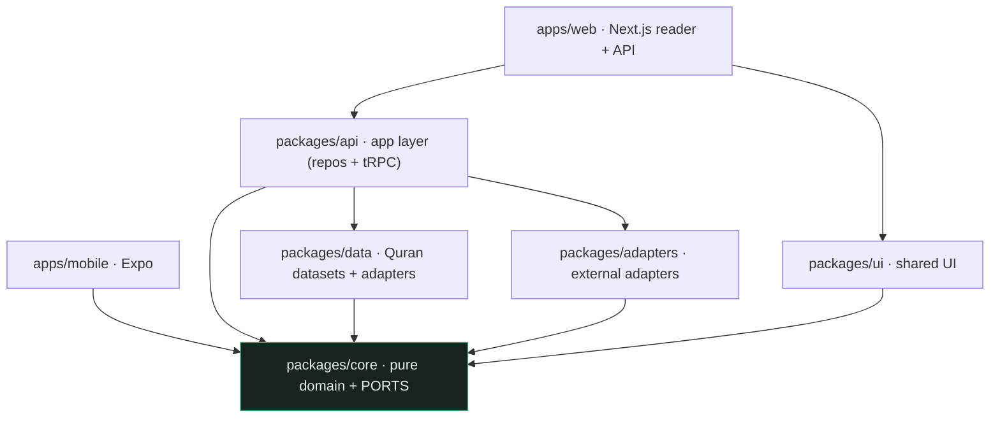
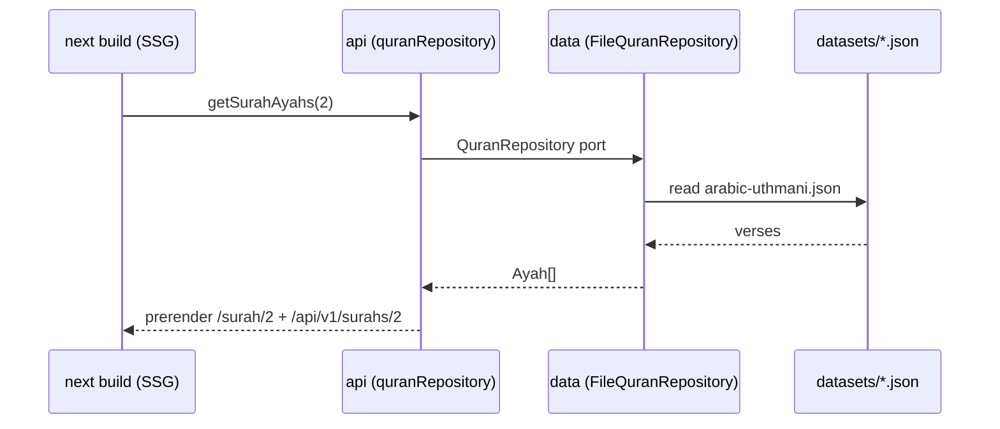
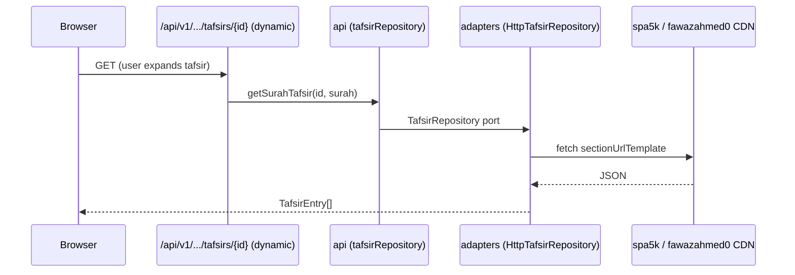
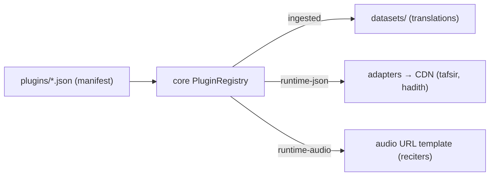

# Architecture

Ummah Library is a **single TypeScript monorepo** (Turborepo + pnpm) built as a
**modular monolith** with **ports & adapters** (hexagonal). This document is the
map; the _why_ behind each decision lives in the [ADRs](docs/adr/).

## The one rule

**Dependencies point inward.** `apps` use `packages`; `packages` never use
`apps`; **`core` depends on nothing**. This is enforced in CI by
`eslint-plugin-boundaries` ([ADR 0001](docs/adr/0001-modular-monolith.md)).

`core` (highlighted) is the centre: it defines **entities** and **ports**
(interfaces); everything else either implements those ports or consumes them.

## Packages

| Package           | Responsibility                                                                                                                                                             | May depend on              |
| ----------------- | -------------------------------------------------------------------------------------------------------------------------------------------------------------------------- | -------------------------- |
| **`core`**        | Pure domain: entities, structural invariants, SM-2 Hifz, plugin contract, **ports**. No framework, DB, network, or clock.                                                  | _nothing_                  |
| **`data`**        | Versioned Quran datasets (`datasets/`, generated by `scripts/ingest.ts`) + the file-backed `QuranRepository`/`TranslationRepository`, plus the plugin registry loader.     | `core`                     |
| **`adapters`**    | Concrete adapters for **external** concerns behind core ports: `HttpTafsirRepository`, `HttpHadithRepository`, `InMemoryHifzRepository`, `SqliteHifzRepository` (subpath). | `core`                     |
| **`api`**         | Application layer: wires the repositories and exposes the **tRPC `AppRouter`**. Apps depend on this, not on `data`/`adapters` directly.                                    | `core`, `data`, `adapters` |
| **`ui`**          | Shared, framework-light UI primitives (kept React-free so web/mobile can share).                                                                                           | `core`                     |
| **`apps/web`**    | Next.js App Router reader + the public REST/OpenAPI + tRPC endpoints (mostly statically generated).                                                                        | `api`, `core`, `ui`        |
| **`apps/mobile`** | Expo app; shares `core`, reads the public REST API.                                                                                                                        | `core`                     |

### `core` — the heart

- `entities.ts` — `Surah`, `Ayah`, `VerseKey`, `Translation`, `TafsirEntry`, `Hadith`, …
- `quran-structure.ts` — invariants (`TOTAL_AYAHS`, `AYAH_COUNTS`, `JUZ_STARTS`, `HIZB_STARTS`, `PAGE_STARTS`) + utils (`isValidVerseRef`, `juzNumberOf`, `pageNumberOf`, `pageRange`, …).
- `hifz.ts` — pure SM-2 scheduler ([ADR 0007](docs/adr/0007-hifz-spaced-repetition.md)).
- `plugins.ts` — the content-plugin contract + `PluginRegistry` ([ADR 0005](docs/adr/0005-content-plugin-system.md)).
- `languages.ts` / `translations.ts` — ISO-639 display names + pure grouping/filtering for the translation picker ([ADR 0010](docs/adr/0010-translation-selection.md)).
- `search.ts` — pure full-text ranking (`searchVerses`, `searchText`) with tashkeel-insensitive Arabic normalisation, powering Quran and Hadith search.
- `ports.ts` — **the interfaces** everything implements: `QuranRepository`, `TranslationRepository`, `TafsirRepository`, `HadithRepository`, `HifzRepository`.

## Data flow

### Reading (build time)

Surah/juzʾ pages and the static REST endpoints are prerendered. Data is read at
**build** time, so there's no database and nothing dynamic at runtime
([ADR 0003](docs/adr/0003-static-first-delivery.md)).

### Runtime content — tafsir & hadith (on demand, in the browser)

Large content isn't bundled; it's fetched on demand through a runtime function
([ADR 0005](docs/adr/0005-content-plugin-system.md)).

### User state (local-first)

Bookmarks, Hifz progress, theme, reading prefs live in `localStorage`; no
accounts, no backend ([ADR 0006](docs/adr/0006-local-first-persistence.md)). The
Hifz UI drives the pure SM-2 engine in `core`.

### Content plugins — three delivery modes

Translations have **both** modes: a small ingested set (offline + REST API) and
the full runtime catalogue of ~490 editions fetched on demand from the
`fawazahmed0/quran-api` CDN ([ADR 0011](docs/adr/0011-translation-catalog-runtime.md)).

## Build & deploy

Push → GitHub Actions (lint · typecheck · test · build, Node 24) with module
boundaries enforced → Vercel deploys on merge to `main`. The output is ~1,560
static pages on the CDN (114 surahs, 30 juzʾ, 604 Mushaf pages, search, …) plus
a handful of dynamic serverless functions (tRPC, single-ayah, tafsir/hadith)
that ship the datasets they need via `outputFileTracingIncludes`.

## Where to put things

See [`AGENTS.md`](AGENTS.md) for the decision table and the do/don't rules that
keep this structure intact.
